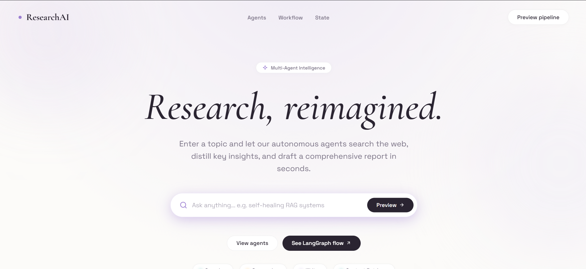

# Multi-Agent Research Assistant

<p align="center">
  
</p>

A multi-agent AI research system built with LangGraph and LangChain that automates research, report generation, and workflow orchestration using collaborative AI agents.

## Features

- Multi-agent workflow
- AI-powered research
- Automated report generation
- Streamlit interface
- Tavily web search integration

## Tech Stack

- Python
- LangGraph
- LangChain
- Streamlit
- Tavily API

## Installation

```bash
git clone https://github.com/ivasann/Multi-Agent-Research-Assistant.git
cd Multi-Agent-Research-Assistant

pip install -r requirements.txt
```
